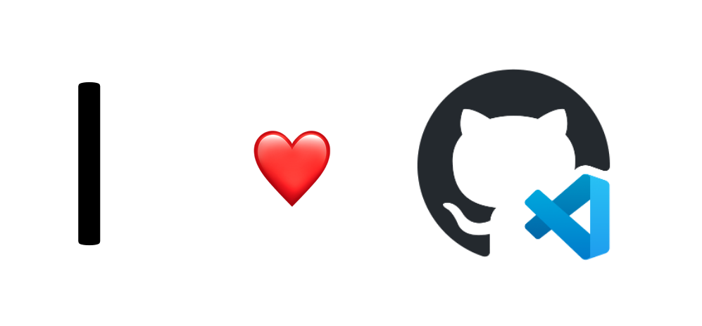

# **Taller GitHub Codespaces**

Hola a todos, este es un taller en línea basado en GitHub Codespaces. Espero contarte cómo usar GitHub Codespaces combinando diferentes contenidos, cómo combinar GitHub Codespaces como tu propia plataforma para aprender lenguajes de programación y mantener tus proyectos a través de GitHub Codespaces, etc.

## **Introducción GitHub Codespaces**

Les comento que GitHub Codespace ya es gratis durante 60 horas al mes a partir de GitHub Universe 2022, pero ¿cómo usar GitHub Codespaces? ¿Cómo configurar tu entorno GitHub Codespaces? ¿Cómo funcionan los espacios de código de GitHub?
A través del estudio de este capítulo, puede dominar el siguiente contenido:

1. ¿Qué es GitHub Codespaces?
2. Cómo usar GitHub Codespaces
3. Cree su proyecto de Python con plantillas de GitHub Codespaces
4. Cree su proyecto .NET a partir de la plantilla en blanco de GitHub Codespaces

Tiempo de estudio: 40 minutos

Contenido relacionado: (<a href="./00.Introduction.md">Haga clic aquí para aprender</a>)

## **Aprende lenguajes de programación con GitHub Codespace**

Aprender un lenguaje de programación es un paso muy importante en el camino hacia la programación. Cuando aprendemos un lenguaje de programación, debemos instalar diferentes entornos, incluido SDK, incluidas algunas bibliotecas y complementos en el IDE. Esto toma mucho de nuestro tiempo. A veces te encontrarás con todo tipo de contenido incompatible. En este momento, podemos combinar GitHub Codespaces para iniciar un entorno de desarrollo listo para usar, de modo que, como principiante, pueda ingresar rápidamente a la programación y experimentar la diversión de programación de diferentes lenguajes de programación. Al estudiar este capítulo, puede dominar lo siguiente:

1. Aprenda .NET a través de GitHub Codespaces (<a href="./01.LearnCSharp.md">haga clic aquí para aprender</a>)
2. Aprenda Java a través de GitHub Codespaces (<a href="./01.LearnJava.md">haga clic aquí para aprender</a>)
3. Aprenda Python con GitHub Codespaces (actualización)
4. Aprenda Rust con GitHub Codespaces (actualización)
5. Aprendizaje de Go con GitHub Codespaces (actualización)
6. Aprende NodeJS con GitHub Codespaces (actualización)

Tiempo de aprendizaje: 180 min

## **Realice aplicaciones nativas de la nube a través de GitHub Codespaces**

En GitHub Codespaces, puede desarrollar y mantener directamente proyectos nativos de la nube para el desarrollo empresarial, y los equipos empresariales pueden abrir el desarrollo de cualquier plataforma en la nube a través de GitHub Codespaces. Esta serie usará algunos ejemplos para guiarlo a través del desarrollo y mantenimiento de proyectos nativos en la nube a través de GitHub Codespaces.

1. Configure el entorno de desarrollo nativo de la nube en GitHub Codespaces (<a href="./02.CloudNativeEnv.md">haga clic aquí para aprender</a>)
2. Cree una aplicación que combine Azure Static Web App y Azure Function a través de GitHub Codespaces (<a href="./02.CloudNativeInAzure.md">haga clic aquí para aprender</a>)
3. Cree una aplicación Dapr a través de GitHub Codespaces (<a href="./02.CloudNativeInDapr.md">haga clic aquí para aprender</a>)
4. Desarrollar una aplicación WasmEdge con Rust (actualización)

Tiempo de aprendizaje: 120 minutos

## **Aprendizaje automático a través de GitHub Codespaces (actualización)**
## **Mantenga su proyecto a través de GitHub Codespaces (actualización)**
